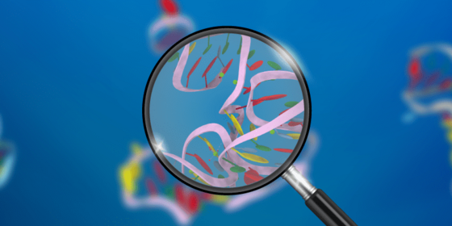

# Stanford RNA Structure Prediction Challenge - Kaggle Competition

## Overview

This repository contains my contributions to the RNA Structure Prediction Challenge, aimed at developing an algorithm capable of predicting the structures of RNA molecules and their chemical mapping profiles. This challenge not only pushes the boundaries of computational biology but also has the potential to revolutionize our approach to medicine and environmental challenges.

### Why This Is Important

RNA molecules are central to numerous biological functions and understanding how they fold is pivotal for advancing our knowledge about life's molecular mechanisms. By predicting RNA structures, we can aid in designing new medicines, potentially offering first cures for diseases like pancreatic cancer and Alzheimer's, and develop novel biotechnologies to address climate change.

### Competition Dates
- **Start Date**: September 7, 2023
- **Close Date**: December 7, 2023

## My Approach

### 1. Preparing Data
For the RNA sequences, I employed two primary encoding strategies:
- **Basic Encoding**: Encoding the four base pairs (A, T, G, C) which involved encoding, padding to maximum length, and appropriate splitting of the dataset.
- **K-mers Approach**: Inspired by the DNABert model, this method involves using k-mers of varying sizes (3,5,7, etc.) to capture more complex biological features from sequences, enhancing the model's learning potential.

These strategies are rooted in ongoing research and best practices in bioinformatics, particularly in how sequence data is prepared for complex models.

### 2. Modeling
The task was framed as a regression problem where the objective is to predict the chemical reactivity of specific base pairs in an RNA sequence. I explored several modeling techniques:
- **Transformer Models**: Ideal for handling sequences of varying lengths and complexities.
- **FNet**: A Fourier Transform-based approach to understand relationships in sequence data.
- **LSTM with Attention**: To capture long-range dependencies in RNA sequences which is crucial for understanding their structure.

### 3. Training on Cloud
This project marked my first extensive use of cloud GPUs outside of platforms like Kaggle/Colab. Setting up an efficient training pipeline on cloud platforms such as AWS, GCP, and especially Vast AI, allowed for scalable computing resources. I implemented continuous logging of statistics and automated saving of models to GitHub, which enhanced the reproducibility and management of the experimental setups.

## Technical Setup

### Directory Structure

- `models/` - Directory containing all trained models, automatically pushed to GitHub post-training.
- `stats_folder/` - Directory for storing statistics associated with the training.
- `data.py` - Contains code for handling dataset operations and auxiliary functions.
- `models.py` - Code for various deep learning models used, including Transformers, FNet, and Attention+LSTM architectures.
- `train.py` - Main training loop.
- `utils.py` - Auxiliary functions supporting various operations in the project.
- `requirements.txt` - Specifies all dependencies required for the project.

### Cloud Computing

This project drove me to properly structure my code for use with GPUs on teh cloud. The project is structured to facilitate easy deployment on cloud computing platforms like Vast-AI, AWS, GCP, and Azure. This flexibility ensures that the computational resources needed for training and prediction tasks are scalable and accessible.

## Project Insights

### Intersection of Passions

This project lies at the intersection of my two passions: deep learning and biology. It represents a fantastic opportunity to apply cutting-edge AI technologies to solve complex biological problems.

### Building Custom Models

Throughout this challenge, I have gained invaluable experience in designing and customizing powerful deep learning architectures tailored for specific biological challenges. This hands-on approach has not only enhanced my technical skills but also deepened my understanding of both fields.

